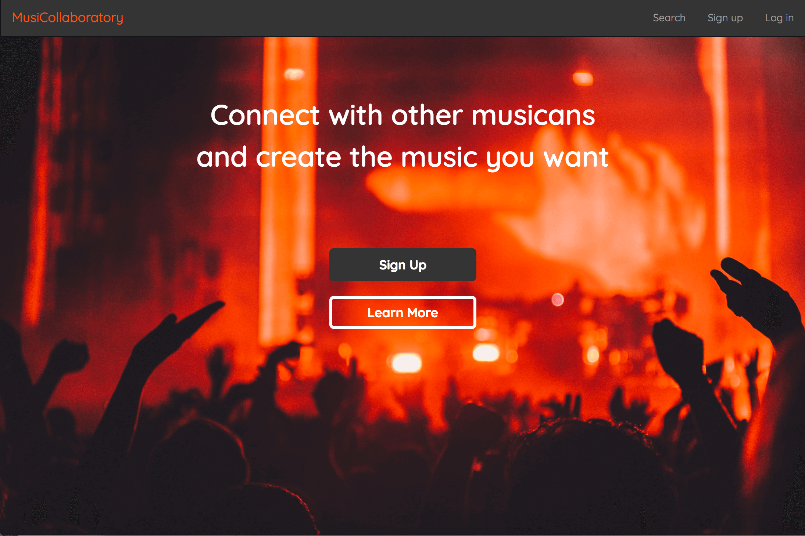

# Musicollaboratory

## Objective
Create a music collaboration app.

### Live Demo:

[Music Collaboration App] (http://musicollaboratory.com/)

### Languages / Technologies used:

* HTML
* CSS
* BOOTSTRAP
* Javascript
* AngularJS
* NodeJS
* Express
* MongoDB

## Description

Users can create music projects, request to contribute to them and, if accepted, can upload/download music, and manage these projects.

## Usage

1. Securely sign up and log in.

2. Create a music project or...

3. Search music projects according to what the project needs and what you want to contribute.
 - Lyrics
 - Voice
 - Production
 - Melody
4. Request to contribute.
  *On the project page, users can learn more about the music project. They also have the option to submit a request to the project owner.
  *The request is sent to the project owner's inbox and a copy of the request is also sent to the user's outbox.
  *Then the project owner can either accept or decline the request.
  *If the request is accepted, the requester will be added to *project admin. As an admin, the user has authorization to edit the project info and upload files.

## Walk Through

#####  1. Home Page => '/'

  

#####  2. Sign Up Page => '/signup'

  

#####  3. Profile Page => '/profile/:username'

  

#####  4. Edit Profile Page => '/profile/:username'

  

#####  5. Save Edits to Profile Page => '/profile/:username'

  

#####  6. Create New Project => '/new/project'

  

#####  7. Create New Project (upload project files) => '/new/project/uploads'

  

#####  8. Project Detail Page => '/project/:projectid'

  

#####  9. Edit Project Detail Page => '/project/:projectid'

  

#####  10. Projects Search Page => '/search'

  

#####  11. Listen to Audio on Project Search Page => '/search'

  

#####  11. Sending a Request on Project Detail Page => '/project/projectid'

  

#####  12. Request Submitted => '/project/projectid'

  

#####  13a. Check Messages from Profile Page => '/profile/:username'

  

#####  13b. Messages Page => '/profile/:username/messages'

  

#####  14. Messages Page (Accept Request from kirk) => '/profile/:username/messages'

  

#####  15. Messages Page (After accepting Request) => '/profile/:username/messages'

  

#####  16. Messages Page (Signed in as kirk) => '/profile/:username:messsages'

  

#####  17. Project Page (kirk is now a member; he's started to write a comment) => '/project/:projectid'

  

#####  18. Project Page (kirk posts a comment) => '/project/:projectid'

  

#####  19. Project Page (Ex. of comments section between members) => '/project/:projectid'

  

#####  20. Project Page (When a project is done => you can toggle the 'mark as completed' button at the bottom of the page) => '/project/:projectid'

  

## Code Snippets (backend)

## Code Snippets (frontend)

## Credits
Kirk Abott,
Carolyn Lam
